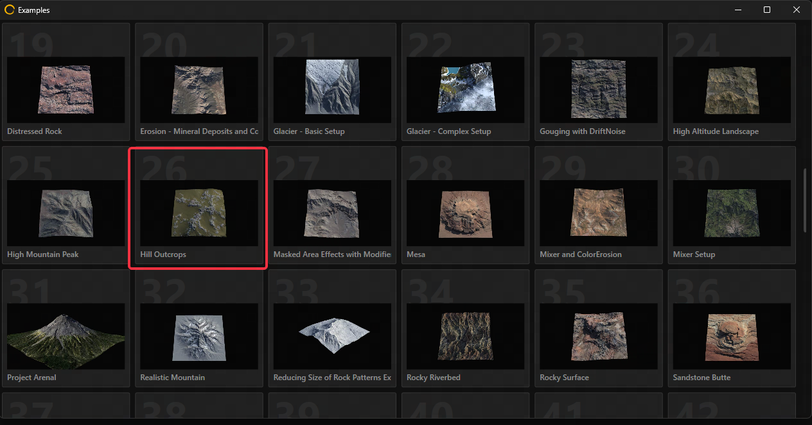
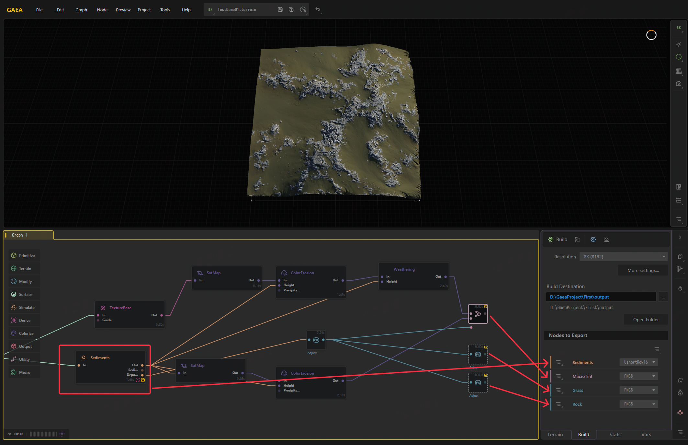
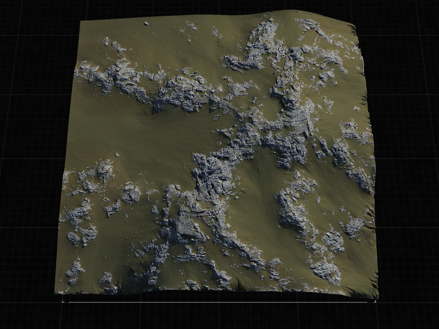
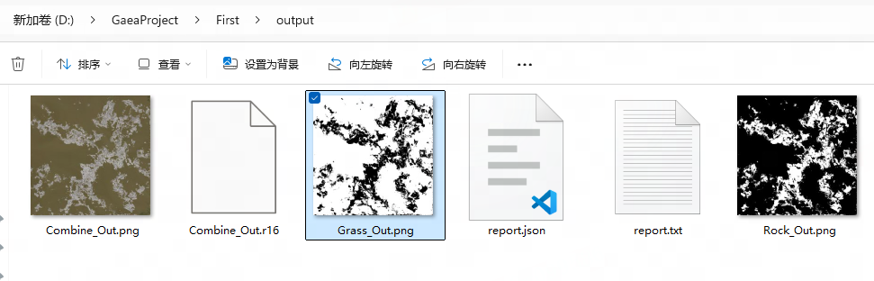
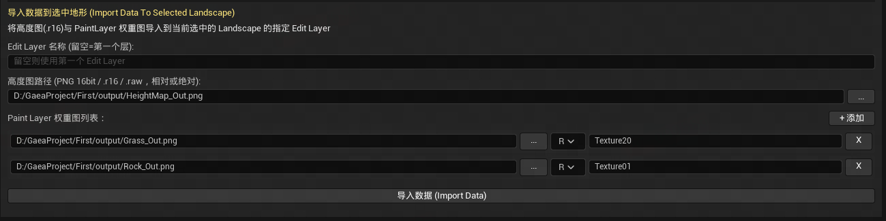
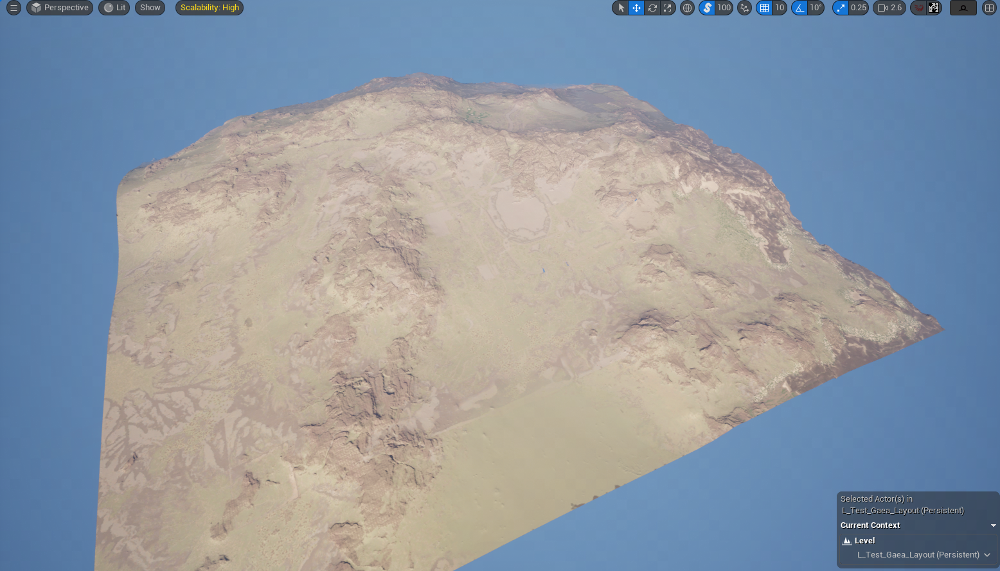
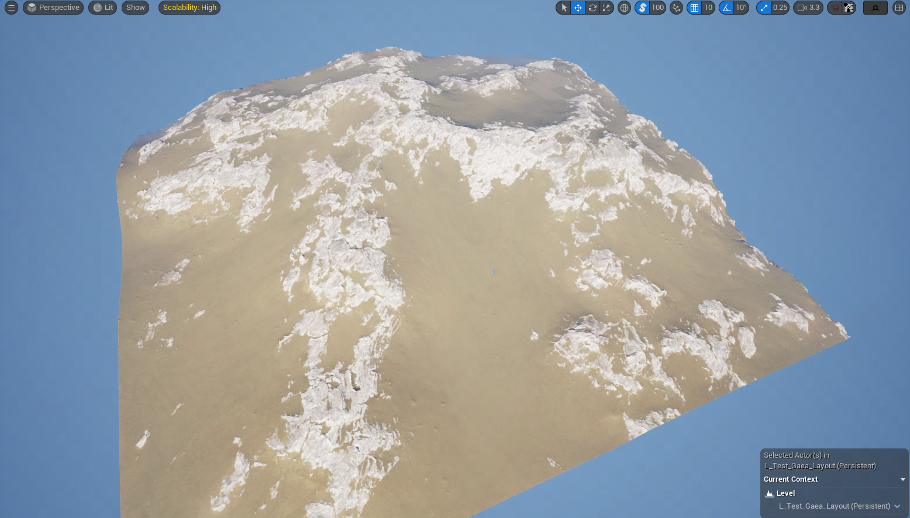
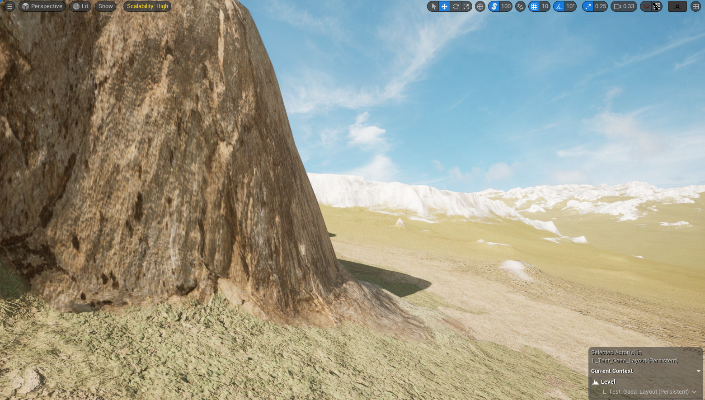
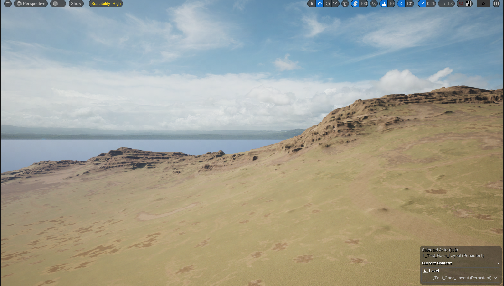
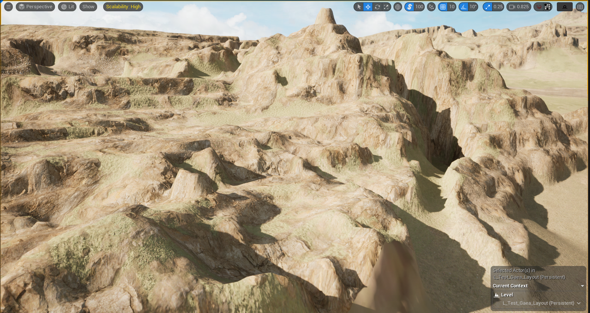

# About This Article

To build a Preoduction-Ready 3A Terrain Pipeline.
“What I cannot create, I do not understand.” — Richard Feynman

# Part Building a Minimal Gaea Terrain in UE5 

## Gaea Example Export

The Key is how to structure the exported texture data and design the terrain rendering pipeline in Unreal Engine.

I modified the Gaea example export:

Pictures include: MacroTint RockWeight GrassWeight Height

## UE5 landscape import gaea pictures
I vibe code a panel to import gaea pictures.

height/weight:

macrotint:
Distance-Based Blending from basecolor to macrotint color

finalcolor = lerp (basecolor, macrotint, distvalue)

near is origin color, far is tinted color

## Key Technical Challenge: Exposed rock surfaces look too rounded and artificial at the micro scale
From a distance, the exposed rock layers look fine.

but up close, they become noticeably blurry and lose surface definition.

The key challenge now is how to make exposed rock layers look natural and visually convincing at close range.